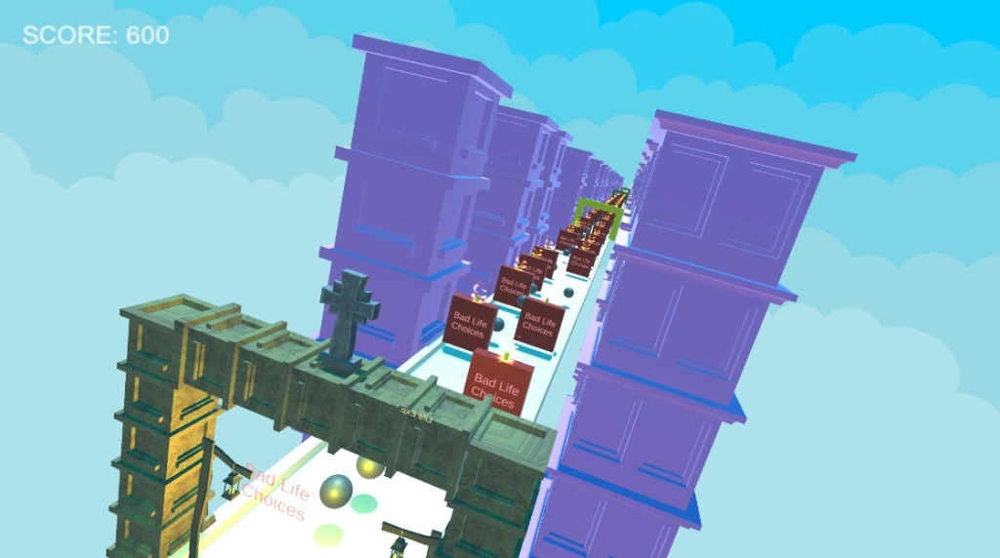

# Leagcy-Runner
- Legacy Runner – Academy Club Game Jam 2021

<h3>DESCRIPTION</h3>
THIS GAME HAS WON ACADEMY CLUB GAMEJAM!
ACADEMY CLUB GAMEJAM BEST 20 WINNER!
First Hypercasual Game Jam.

Legacy Runner is the game we've created with my dear friend Barış Bali. It was a really stressful and fun experience. At the end of 48 hours we managed to finish most of the game and now we are just waiting for the results.

In this game while you are getting old and getting closer to death you need to collect power ups.
Those power ups will be useful after your death and a new young character will use them. Game continues in this loop till you end up making bad life choices 🤷🏻‍♂️

More projects are on the horizon ☀️

Title: Legacy Runner

 <b>Screenshots</b>

Screenshots           |  Screenshots 
:-------------------------:|:-------------------------:
  |  
  |  
  |  

 <b>Demo Video</b>  

<video src="https://www.youtube.com/embed/i-kMJllLpik?si=04EAqE4BHfQkwR2b" width=180/></video>
